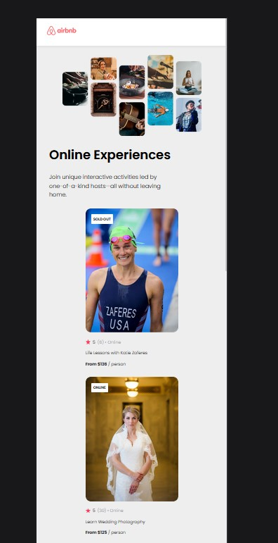
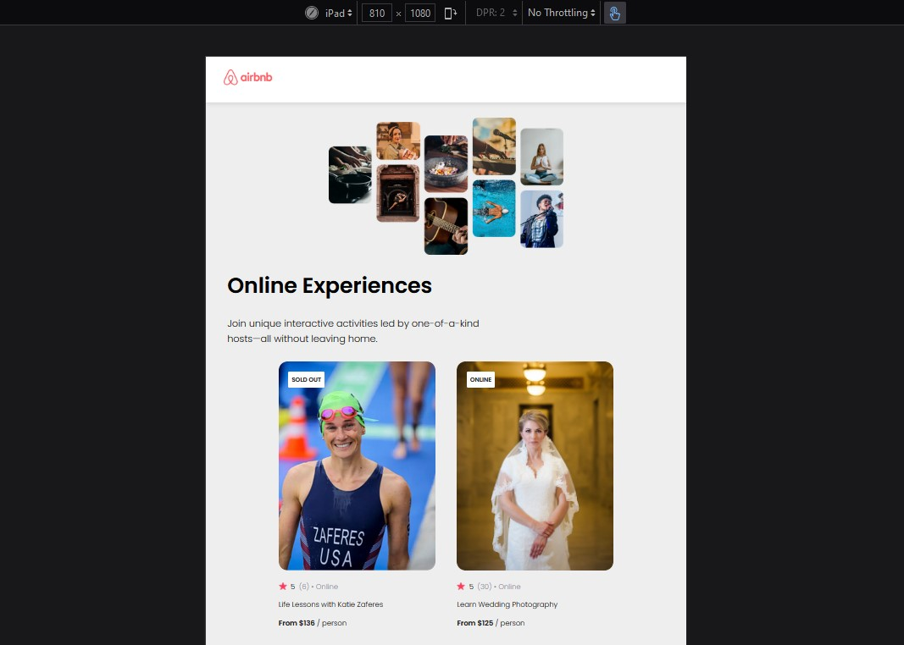
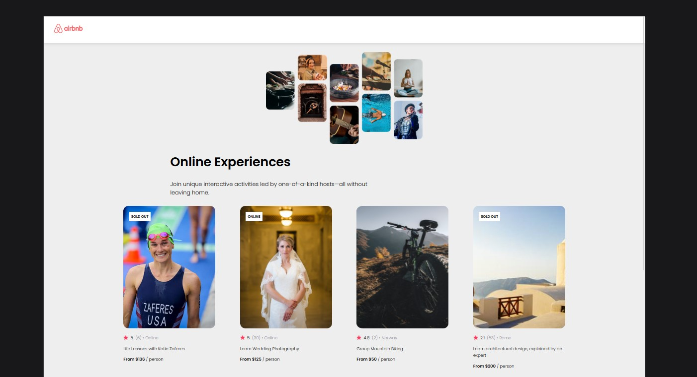

# Scrimba React AirBnB Project {AirBnB Experience}

This project was bootstrapped with [Create React App](https://github.com/facebook/create-react-app).

This is a solution to the [Scrimba React Course on Scrimba](https://scrimba.com/learn/learnreact/react-section-2-solo-project).
The course is offered for FREE on Scrimba by Bob Ziroll [Learn React](https://scrimba.com/learn/learnreact)(An amazing tutor -- really understood his course)

## Table of contents

- [Overview](#overview)
  - [The challenge](#the-challenge)
  - [Screenshot](#screenshot)
  - [Links](#links)
- [My process](#my-process)
  - [Built with](#built-with)
  - [What I learned](#what-i-learned)
  - [Continued development](#continued-development)
- [Author](#author)
-[Acknowledgments](#acknowledgments)

## Overview

### The challenge

Recreate the AirBnb Experience using React

Requirements : -

- Build from Scratch!
- Add data dynamically from `data.js` by `mappping` using `props`
- Separate components for :- - Navbar (AirBnB Logo) - Hero(Hero Image) - Card (where the fun stuff's at ...all the details)
- Enjoy the build

### Screenshot

Screenshot of Mobile preview of the AirBnb Experience



Screenshot of Tablet mode view of the AirBnb Experience



Screenshot of Laptop and Larger screens preview of the AirBnb Experience




### Links

- Solution URL: [GitHub Link](https://github.com/issagoodlifeInc/airbnb.git)
- Live Site URL: [Netlify Deploy](https://AirBnBleskim.netlify.app/)

## My process

First worked on the NavBar and Hero sections as per the [Figma model](https://www.figma.com/file/d00Reyp7biZMav40GhWxVT/Airbnb-Experiences-(Copy)?node-id=2%3A2) shared on Scrimba
Then worked on the `Card` part first writing out the info before mapping it out using props with the data from the `data.js` file
Added in logics such as the situation of the Card using properties such as openCount from the file to cater for when an item is sold out
Styled the work making it more responsive

### Built with

- React
- JSX syntax
- Semantic HTML5 markup
- CSS custom properties
- Flexbox

### What I learned

- Using `props` and `mapping` in React

```js
const myData = data.map(data => {
      return(
          <Card
          key={data.id}
          data={data}
          />
      )
  })
```

```js
return(
        <div className="card">
            <div className="card--situation">
          {situationText && <h5 className="card--situation_text">{situationText}</h5>}
            </div>
            
            <p className="card--stars">
            
            {props.data.stats.rating} <span className='no_stars'>({props.data.stats.reviewCount}) • {props.data.location} </span></p>
            <p className="card--text">{props.data.title}</p>
            <p className="card--price"><span>From ${props.data.price}</span> / person</p>
        </div>

)
```

- Inserting images by requiring the when in the src folder
Spent a whole load of time working on this finally it worked after snooping on solutions to this in the [#today-I-did](https://discord.com/channels/684009642984341525/919153471691849769/985538609430016000) channel in the Scrimba Discord Community

```js
const src = require(`../images/${props.data.coverImg}`);
```

- Using Figma files to code

- React! React! React!

### Continued development

- Learning more React! (yeah reenacting React problems and tackling them)

- Better turnaround time -- simple stuff but worked on it for a while

- Less Code (code cleanup)

## Author

- Website - [Lesley Kimutai](https://leskim.github.io/myweb/)
- Frontend Mentor - (https://www.frontendmentor.io/profile/Leskim)
